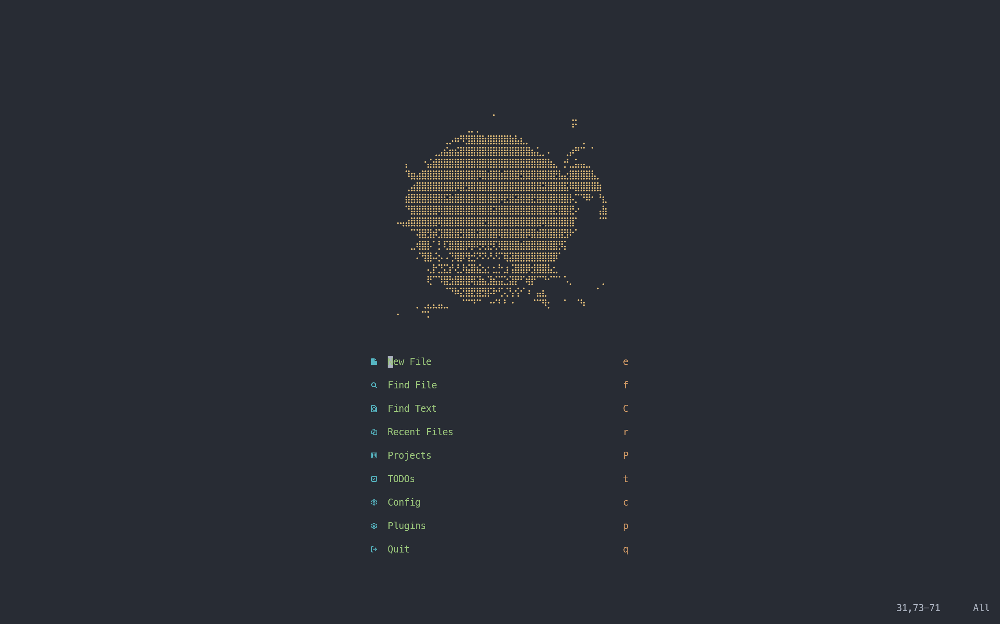
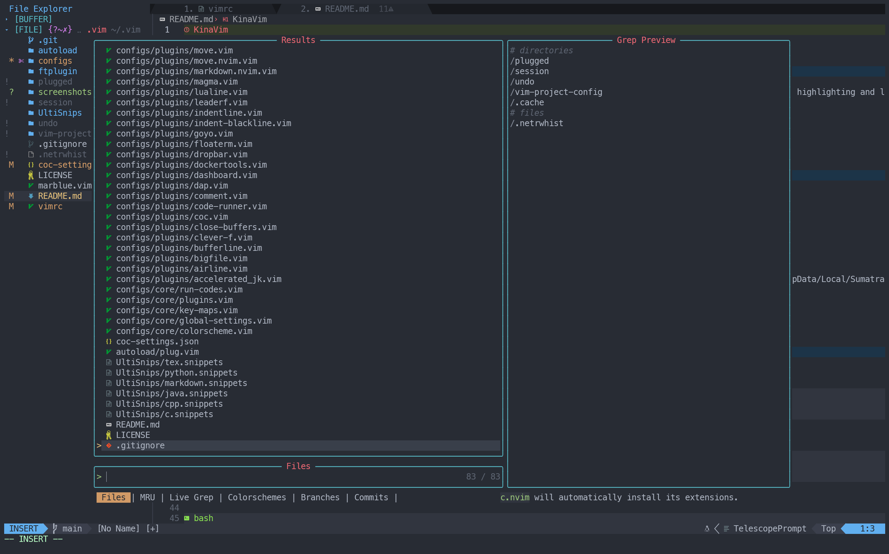
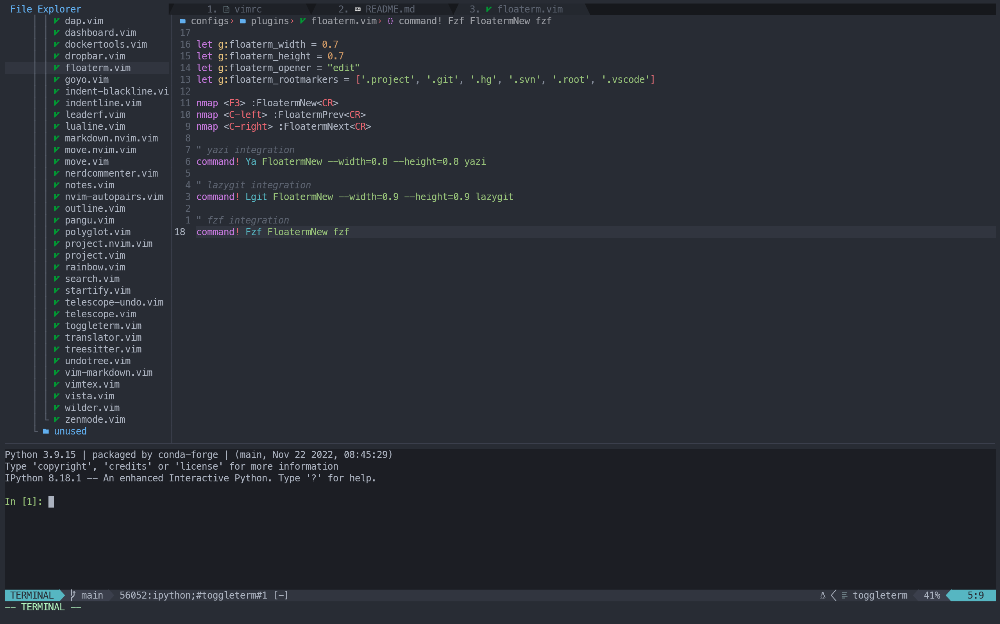
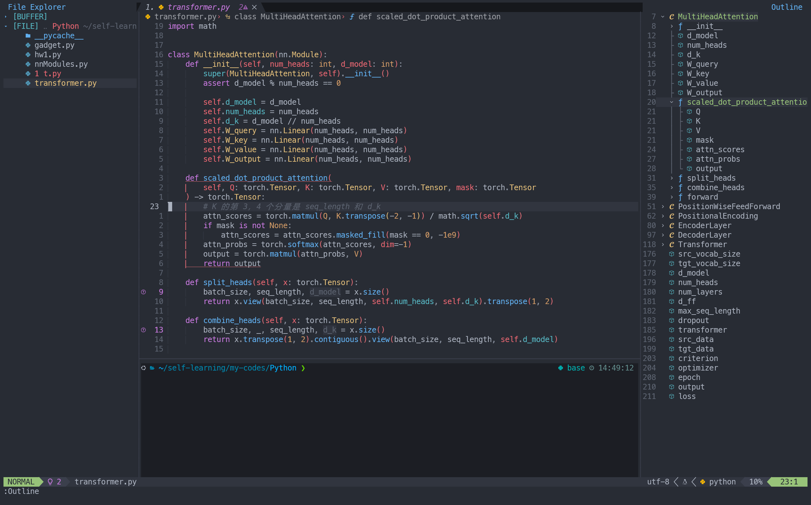
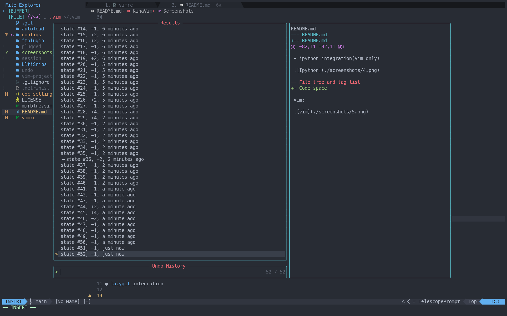
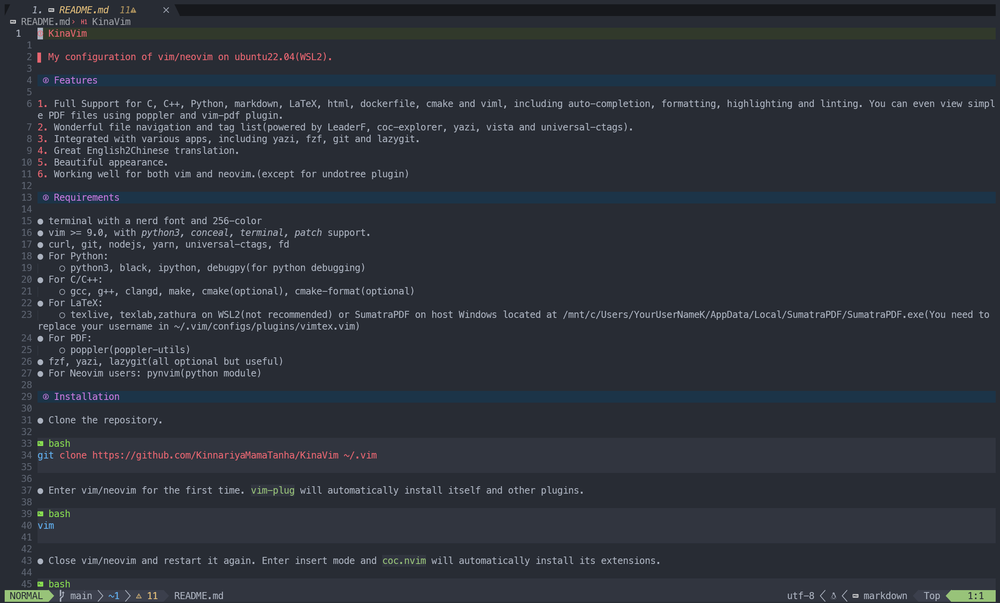
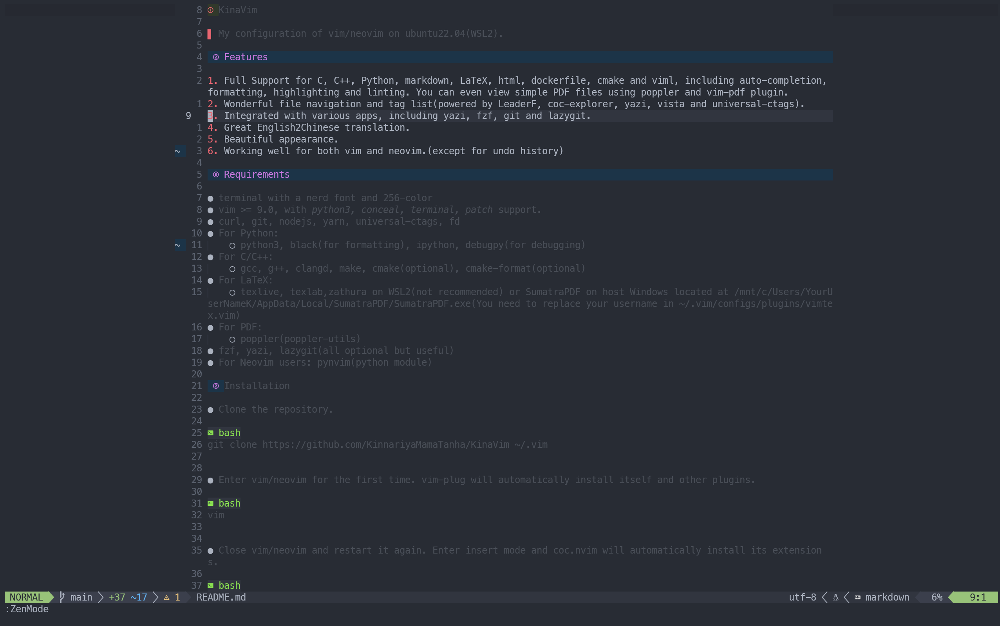
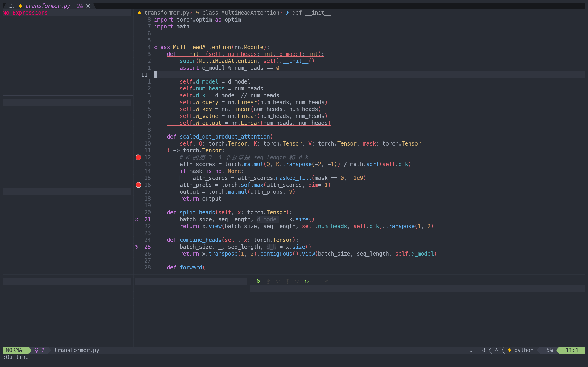

# KinaVim

> [!WARNING]
> PAY ATTENTION!
> I'm using pure lua configurations for neovim now. See [KinanVim](https://github.com/KinnariyaMamaTanha/KinanVim)

> My configuration of vim/neovim on ubuntu22.04(WSL2).

## Features

1. Full Support for C, C++, Assembly, Python, Markdown, LaTeX, html, dockerfile, cmake, lua and viml, including auto-completion, formatting, highlighting and linting functions. You can even view simple PDF files using poppler and vim-pdf plugin. For C, C++ and Python, there is a complete working flow: coding, compiling, running and debugging.
2. Wonderful file navigation and tag list(powered by telescope, coc-list, LeaderF, coc-explorer, yazi, vista and universal-ctags).
3. Integrated with various apps, including yazi, fzf, git, lazygit, lazydocker, Ipython and Python.
4. Great English2Chinese translation. You can enjoy multi-language translation in neovim.
5. Beautiful appearance(especially in Neovim).
6. Working well for both vim and neovim.(except that if you use neovim and vim at the same time, the undo history will conflict)

## Requirements

- terminal with a nerd font and 256-color
- vim >= 9.0, with *python3, conceal, terminal, patch* support; **OR** neovim(I am using 0.10 now).
- curl, git, nodejs, yarn, universal-ctags[^4], fd, sed(1)[^5]
- For Python:
    - python3, black(formatter)[^1] [^2], ipython, debugpy(debugger)[^1] [^2] [^5], Anaconda or Miniconda >= 4.6[^5]
- For C/C++:
    - gcc, g++, clangd(LSP)[^1], make, cmake, cmake-format(formatter)[^1] [^5], cmake-language-server(LSP)[^1] [^2], codelldb(debugger)[^1] [^5]
- For LaTeX:
    - texlive, texlab(LSP)[^1] [^3], latexindent(formatter)[^1], zathura on WSL2(not recommended) or SumatraPDF on host Windows located at `/mnt/c/Users/YourUserName/AppData/Local/SumatraPDF/SumatraPDF.exe`(You need to replace your username in `~/.vim/configs/plugins/vimtex.vim)`!!!
- For Assembly:
    - asm-lsp(LSP)[^1], asmfmt(formatter)[^1] [^5]
- For PDF:
    - poppler(poppler-utils) or pdftotext[^2]
- For sqlite:
    - sqlite3
- For hex[^5]:
    - xxd
- For docker:
    - docker, lazydocker(optional)[^5]
- For lua:
    - lua-language-server[^1]
- fzf, yazi, lazygit(all optional but useful)
- For Neovim users: pynvim(python module)[^2], and tree-sitter-cli[^3]

[^1]: If using Neovim, can be installed with mason.nvim
[^2]: Can be installed with pip or conda
[^3]: Can be installed with cargo
[^4]: Vim only
[^5]: Neovim only

## Installation

- Clone the repository.

```bash
git clone https://github.com/KinnariyaMamaTanha/KinaVim ~/.vim
```

- Enter vim/neovim for the first time. `vim-plug` will automatically install itself and other plugins.

```bash
vim
# nvim
```

- Close vim/neovim and restart it again. Enter insert mode and `coc.nvim` will automatically install its extensions.

```bash
vim ~/.vim/vimrc
# nvim ~/.vim/vimrc
```

- After install all the plugins, you should:

1. For **Vim** users: Place `~/.vim/plugged/onedark.vim/autoload/airline/themes/onedark.vim` in your `~/.vim/plugged/vim-airline/autoload/airline/themes/` directory
2. For **Vim** users: modify the source code of `vim-startify` in `~/.vim/plugged/vim-startify/autoload/startify.vim` according to the [issue](https://github.com/mhinz/vim-startify/issues/400#issuecomment-565858638)（6.9.2024: I forked the code of [mhinz/vim-startify](https://github.com/mhinz/vim-startify) and make some modifications, so now you don't need to fix the trouble manually, however, I won't develop any other functions so you may still need to switch to the original repository）
3. For **Neovim** users: see neovim's [Transitioning from Vim](https://neovim.io/doc/user/nvim.html#nvim-from-vim).
4. For **Neovim** users: add `export PATH="$PATH:$HOME/.vim/mason/bin` to your `.bashrc` or `.zshrc` or so, then install LSPs, DAPs, etcs with mason.nvim.
5. **Wakatime** setup: If you have a [wakatime](https://wakatime.com/) account, you should also set up wakatime plugin according to [vim-wakatime](https://github.com/wakatime/vim-wakatime).
6. **Copilot** setup: If you have a GitHub copilot account, you should set up [copilot.vim](https://github.com/github/copilot.vim) in Vim or [copilot.lua](https://github.com/zbirenbaum/copilot.lua) in Neovim according to their READMEs.
7. Press hot-key `TD` to see all the configurations you need to modify.
8. Read the configurations to be familiar with its keymaps and functions.

## Plugins

<details>
  <summary><b>General</b></summary>

- [junegunn/vim-plug](https://github.com/junegunn/vim-plug)
- [neoclide/coc.nvim](https://github.com/neoclide/coc.nvim)
- [honza/vim-snippets](https://github.com/honza/vim-snippets)
- [dhruvasagar/vim-table-mode](https://github.com/dhruvasagar/vim-table-mode)
- [rhysd/clever-f.vim](https://github.com/rhysd/clever-f.vim)
- [tpope/vim-repeat](https://github.com/tpope/vim-repeat)
- [wakatime/vim-wakatime](https://github.com/wakatime/vim-wakatime)
- [kkvh/vim-docker-tools](https://github.com/kkvh/vim-docker-tools)
- [hotoo/pangu.vim](https://github.com/hotoo/pangu.vim)
- [lervag/vimtex](https://github.com/lervag/vimtex)
- [makerj/vim-pdf](https://github.com/makerj/vim-pdf)
- [mayanksuman/vim-notes-markdown](https://github.com/mayanksuman/vim-notes-markdown)
- [tpope/vim-fugitive](https://github.com/tpope/vim-fugitive)
- [dstein64/vim-startuptime](https://github.com/dstein64/vim-startuptime)
- [chrisbra/csv.vim](https://github.com/chrisbra/csv.vim)
- [lambdalisue/vim-suda](https://github.com/lambdalisue/vim-suda)

<details>
  <summary><b>coc.nvim plugins</b></summary>

- [josa42/coc-sh](https://github.com/josa42/coc-sh)
- [neoclide/coc-json](https://github.com/neoclide/coc-json)
- [iamcco/coc-vimlsp](https://github.com/iamcco/coc-vimlsp)
- [fannheyward/coc-pyright](https://github.com/fannheyward/coc-pyright)
- [clangd/coc-clangd](https://github.com/clangd/coc-clangd)
- [fannheyward/coc-markdownlint](https://github.com/fannheyward/coc-markdownlint)
- [neoclide/coc-git](https://github.com/neoclide/coc-git)
- [weirongxu/coc-explorer](https://github.com/weirongxu/coc-explorer)
- [neoclide/coc-snippets](https://github.com/neoclide/coc-snippets)
- [bigshans/coc-word](https://github.com/bigshans/coc-word)
- [neoclide/coc-yank](https://github.com/neoclide/coc-yank)
- [yaegassy/coc-pydocstring](https://github.com/yaegassy/coc-pydocstring)
- [josa42/coc-docker](https://github.com/josa42/coc-docker)
- [fannheyward/coc-ecdict](https://github.com/fannheyward/coc-ecdict)
- [weirongxu/coc-webview](https://github.com/weirongxu/coc-webview)
- [weirongxu/coc-markdown-preview-enhanced](https://github.com/weirongxu/coc-markdown-preview-enhanced)
- [neoclide/coc-html](https://github.com/neoclide/coc-html)
- [hexh250786313/coc-todo-tree](https://github.com/hexh250786313/coc-todo-tree) (Vim only)
- [voldikss/coc-floaterm](https://github.com/voldikss/coc-floaterm) (Vim only)
- [fannheyward/coc-texlab](https://github.com/fannheyward/coc-texlab)
- [josa42/coc-lua](https://github.com/josa42/coc-lua)

</details>

</details>

<details>
  <summary><b>Neovim only</b></summary>

- [HiPhish/rainbow-delimiters.nvim](https://github.com/HiPhish/rainbow-delimiters.nvim)
- [nvim-treesitter/nvim-treesitter](https://github.com/nvim-treesitter/nvim-treesitter)
- [navarasu/onedark.nvim](https://github.com/navarasu/onedark.nvim)
- [folke/tokyonight.nvim](https://github.com/folke/tokyonight.nvim)
- [Mofiqul/vscode.nvim](https://github.com/Mofiqul/vscode.nvim)
- [nvim-tree/nvim-web-devicons](https://github.com/nvim-tree/nvim-web-devicons)
- [nvim-lualine/lualine.nvim](https://github.com/nvim-lualine/lualine.nvim)
- [folke/twilight.nvim](https://github.com/folke/twilight.nvim)
- [folke/zen-mode.nvim](https://github.com/folke/zen-mode.nvim)
- [hedyhli/outline.nvim](https://github.com/hedyhli/outline.nvim)
- [natecraddock/workspaces.nvim](https://github.com/natecraddock/workspaces.nvim)
- [nvim-lua/plenary.nvim](https://github.com/nvim-lua/plenary.nvim)
- [nvim-telescope/telescope.nvim](https://github.com/nvim-telescope/telescope.nvim)
- [Bekaboo/dropbar.nvim](https://github.com/Bekaboo/dropbar.nvim)
- [akinsho/bufferline.nvim](https://github.com/akinsho/bufferline.nvim)
- [CRAG666/code_runner.nvim](https://github.com/CRAG666/code_runner.nvim)
- [windwp/nvim-autopairs](https://github.com/windwp/nvim-autopairs)
- [numToStr/Comment.nvim](https://github.com/numToStr/Comment.nvim)
- [lukas-reineke/indent-blankline.nvim](https://github.com/lukas-reineke/indent-blankline.nvim)
- [akinsho/toggleterm.nvim](https://github.com/akinsho/toggleterm.nvim)
- [nvimdev/dashboard-nvim](https://github.com/nvimdev/dashboard-nvim)
- [kylechui/nvim-surround](https://github.com/kylechui/nvim-surround)
- [fedepujol/move.nvim](https://github.com/fedepujol/move.nvim)
- [MeanderingProgrammer/markdown.nvim](https://github.com/MeanderingProgrammer/markdown.nvim)
- [mfussenegger/nvim-dap](https://github.com/mfussenegger/nvim-dap)
- [nvim-neotest/nvim-nio](https://github.com/nvim-neotest/nvim-nio)
- [rcarriga/nvim-dap-ui](https://github.com/rcarriga/nvim-dap-ui)
- [mfussenegger/nvim-dap-python](https://github.com/mfussenegger/nvim-dap-python)
- [LunarVim/bigfile.nvim](https://github.com/LunarVim/bigfile.nvim)
- [gelguy/wilder.nvim](https://github.com/gelguy/wilder.nvim)
- [FabianWirth/search.nvim](https://github.com/FabianWirth/search.nvim)
- [debugloop/telescope-undo.nvim](https://github.com/debugloop/telescope-undo.nvim)
- [williamboman/mason.nvim](https://github.com/williamboman/mason.nvim)
- [stevearc/conform.nvim](https://github.com/stevearc/conform.nvim)
- [VidocqH/data-viewer.nvim](https://github.com/VidocqH/data-viewer.nvim)
- [folke/trouble.nvim](https://github.com/folke/trouble.nvim)
- [zbirenbaum/copilot.lua](https://github.com/zbirenbaum/copilot.lua)
- [kmontocam/nvim-conda](https://github.com/kmontocam/nvim-conda)
- [RaafatTurki/hex.nvim](https://github.com/RaafatTurki/hex.nvim)
- [potamides/pantran.nvim](https://github.com/potamides/pantran.nvim)
- [rcarriga/nvim-notify](https://github.com/rcarriga/nvim-notify)
- [Eandrju/cellular-automaton.nvim](https://github.com/Eandrju/cellular-automaton.nvim)

</details>

<details>
  <summary><b>Vim only</b></summary>

- [KinnariyaMamaTanha/vim-startify](https://github.com/KinnariyaMamaTanha/vim-startify)
- [Yggdroot/LeaderF](https://github.com/Yggdroot/LeaderF)
- [voldikss/vim-translator](https://github.com/voldikss/vim-translator)
- [scrooloose/nerdcommenter](https://github.com/scrooloose/nerdcommenter)
- [liuchengxu/vista.vim](https://github.com/liuchengxu/vista.vim)
- [luochen1990/rainbow](https://github.com/luochen1990/rainbow) [](https://github.com/)
- [sheerun/vim-polyglot](https://github.com/sheerun/vim-polyglot)
- [vim-airline/vim-airline](https://github.com/vim-airline/vim-airline)
- [ryanoasis/vim-devicons](https://github.com/ryanoasis/vim-devicons)
- [Asheq/close-buffers.vim](https://github.com/Asheq/close-buffers.vim)
- [joshdick/onedark.vim](https://github.com/joshdick/onedark.vim)
- [mbbill/undotree](https://github.com/mbbill/undotree)
- [rhysd/accelerated-jk](https://github.com/rhysd/accelerated-jk)
- [junegunn/goyo.vim](https://github.com/junegunn/goyo.vim)
- [junegunn/limelight.vim](https://github.com/junegunn/limelight.vim)
- [lambdalisue/vim-nerdfont](https://github.com/lambdalisue/vim-nerdfont)
- [lambdalisue/glyph-palette.vim](https://github.com/lambdalisue/glyph-palette.vim)
- [leafOfTree/vim-project](https://github.com/leafOfTree/vim-project)
- [voldikss/vim-floaterm](https://github.com/voldikss/vim-floaterm)
- [Yggdroot/indentLine](https://github.com/Yggdroot/indentLine)
- [tpope/vim-surround](https://github.com/tpope/vim-surround)
- [matze/vim-move](https://github.com/matze/vim-move)
- [preservim/vim-markdown](https://github.com/preservim/vim-markdown)
- [github/copilot.vim](https://github.com/github/copilot.vim)

</details>

## Future Plans

- [ ] Add support for sql
- [x] Integration with copilot (for neovim)
- [ ] Add support for remote development
- [ ] Better support for makefile, cmake and docker.
  - [ ] makefile
  - [ ] cmake
  - [x] docker
- [ ] Editing and running jupyter notebook inside neovim.
- [x] Support Conda venv (de)activating without leaving neovim.
- [ ] Better user experience

## Screenshots

### Startup UI

<details>
  <summary><b>vim</b></summary>


</details>

<details>
  <summary><b>neovim</b></summary>



</details>

### Fuzzy finder

<details>
  <summary><b>vim</b></summary>


</details>

<details>
  <summary><b>neovim</b></summary>



</details>

### Floating terminal

<details>
  <summary><b>vim</b></summary>


</details>

### ipython integration

<details>
  <summary><b>vim</b></summary>


</details>

<details>
  <summary><b>neovim</b></summary>



</details>

### Code space

<details>
  <summary><b>vim</b></summary>


</details>

<details>
  <summary><b>neovim</b></summary>



</details>

### Undo history

<details>
  <summary><b>vim</b></summary>


</details>

<details>
  <summary><b>neovim</b></summary>



</details>

### [yazi](https://github.com/sxyazi/yazi) integration

<details>
  <summary><b>vim and neovim</b></summary>


</details>

### Git information integration

<details>
  <summary><b>vim and neovim</b></summary>


</details>

### [lazygit](https://github.com/jesseduffield/lazygit) integration

<details>
  <summary><b>vim and neovim</b></summary>


</details>

### Markdown preview

<details>
  <summary><b>vim</b></summary>


</details>

<details>
  <summary><b>neovim</b></summary>



</details>

### Zen mode

<details>
  <summary><b>vim</b></summary>


</details>

<details>
  <summary><b>neovim</b></summary>



</details>

### Debugging

<details>
  <summary><b>neovim</b></summary>



</details>
