# KinaVim

> My configuration of vim on ubuntu22.04(WSL2).

## Features

1. Full Support for C, C++, Python, markdown, LaTeX, html, dockerfile, cmake and viml, including auto-completion, formatting, highlighting and linting. You can even view simple PDF files using poppler and vim-pdf plugin.
2. Wonderful file navigation and tag list(powered by LeaderF, coc-explorer, yazi, vista and universal-ctags).
3. Integrated with various apps, including yazi, fzf, git and lazygit.
4. Great English2Chinese translation.
5. Beautiful appearance.

## Requirements

- terminal with a nerd font and 256-color
- vim >= 9.0, with *python3, conceal, terminal, patch* support.
- curl, git, nodejs, yarn, universal-ctags
- For Python:
    - python3, black
- For C/C++:
    - gcc, g++, clangd, make, cmake(optional), cmake-format(optional)
- For LaTeX:
    - texlive, texlab,zathura on WSL2(not recommended) or SumatraPDF on host Windows located at /mnt/c/Users/YourUserNameK/AppData/Local/SumatraPDF/SumatraPDF.exe(You need to replace your username in ~/.vim/configs/plugins/vimtex.vim)
- For PDF:
    - poppler(poppler-utils)
- fzf, yazi, lazygit(all optional but useful)

## Installation

- Clone the repository.

```bash
git clone https://github.com/KinnariyaMamaTanha/KinaVim ~/.vim
```

- Enter vim for the first time. `vim-plug` will automatically install itself and other plugins.

```bash
vim
```

- Close vim and restart it again. Enter insert mode and `coc.nvim` will automatically install its extensions.

```bash
vim ~/.vim/vimrc
```

- After install all the plugins, you should:

1. Place `~/.vim/plugged/onedark.vim/autoload/airline/themes/onedark.vim` in your `~/.vim/plugged/vim-airline/autoload/airline/themes/` directory
2. Modify the source code of `vim-startify` in `~/.vim/plugged/vim-startify/autoload/startify.vim` according to the [issue](https://github.com/mhinz/vim-startify/issues/400#issuecomment-565858638)（6.9.2024: I forked the code of [mhinz/vim-startify](https://github.com/mhinz/vim-startify) and make some modifications, so now you don't need to fix the trouble manually, however, I won't develop any other functions so you may still need to switch to the original repository）
3. Read the config to be familiar with its keymaps and functions.

## Screenshots

- Startup UI

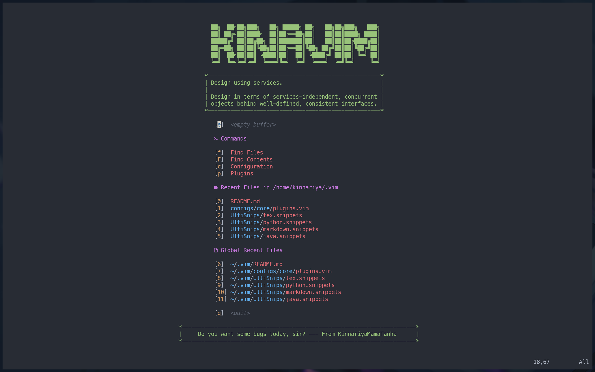

- Fuzzy finder

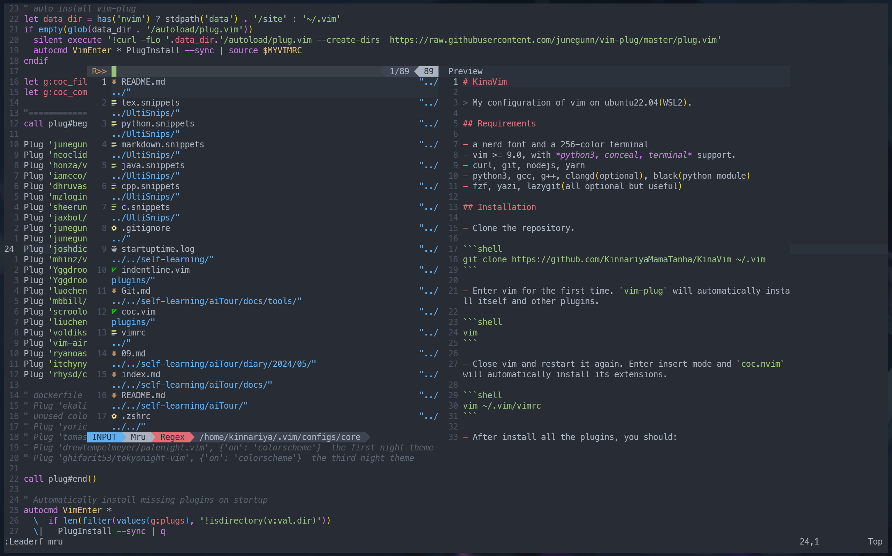

- Floating terminal

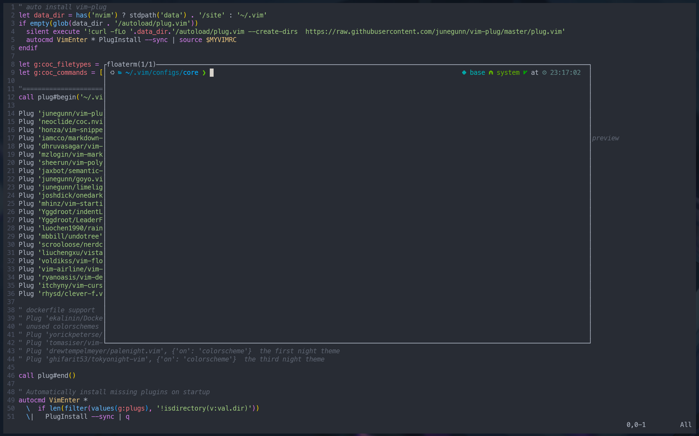

- ipython integration

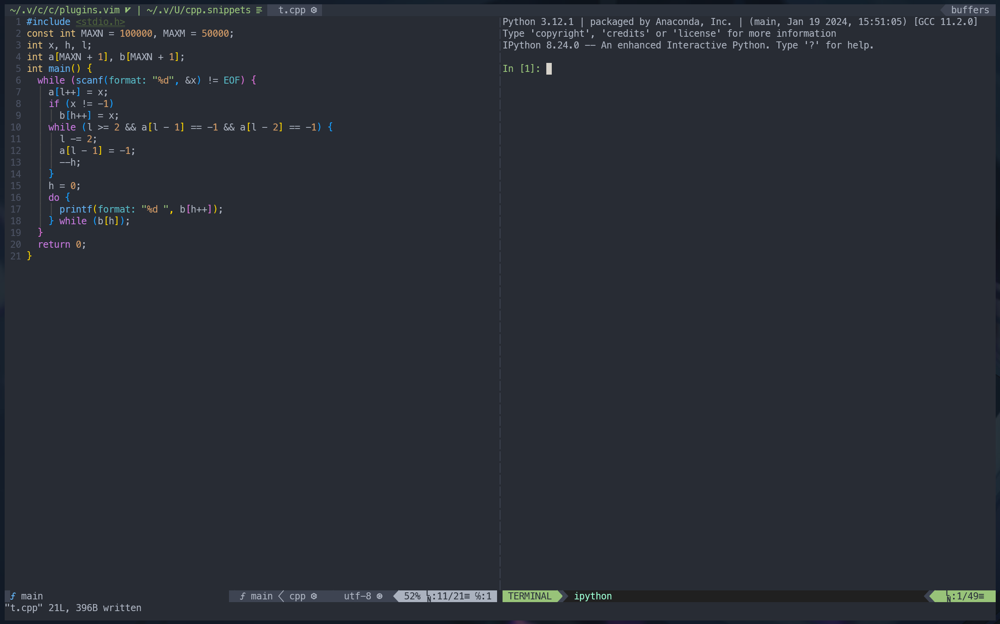

- File tree and tag list

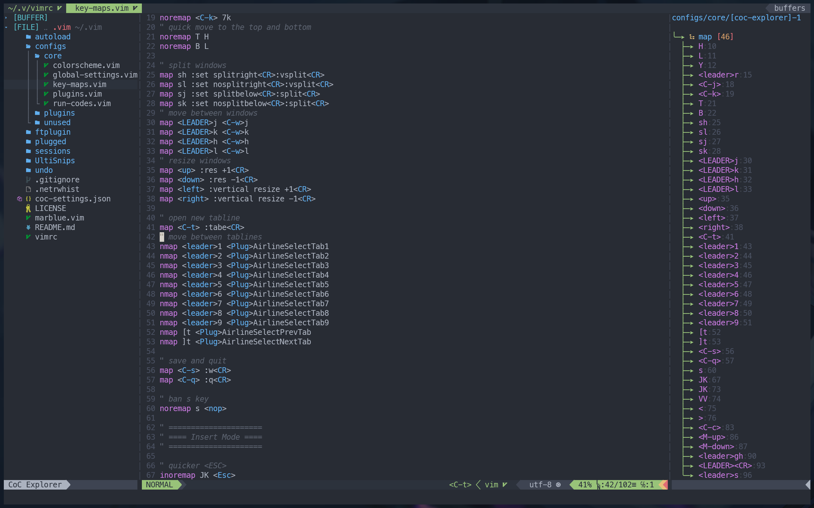

- Undo history

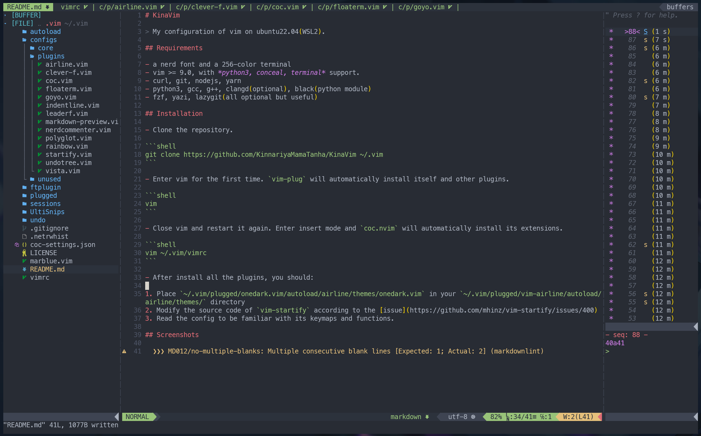

- [yazi](https://github.com/sxyazi/yazi) integration

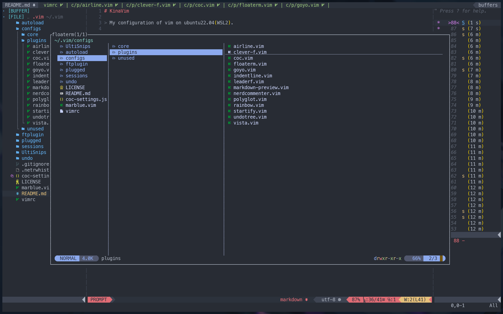

- Git information integration

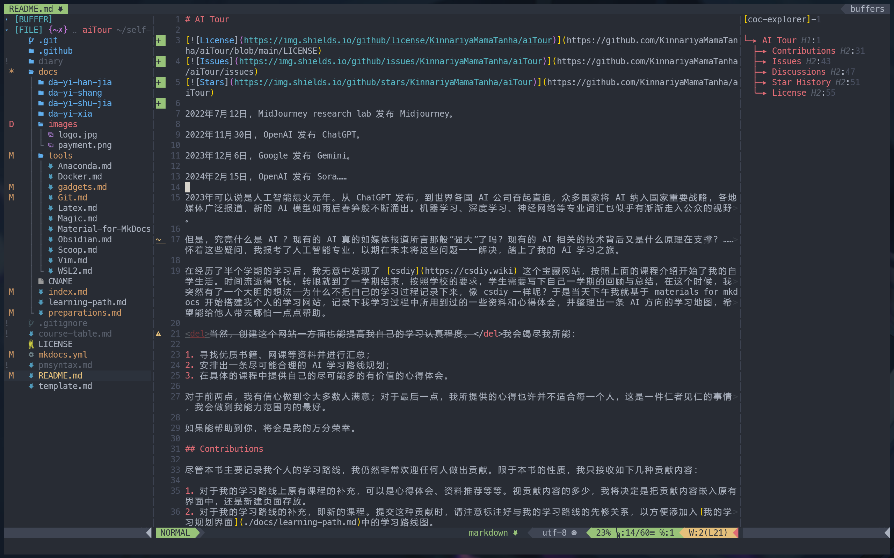

- [lazygit](https://github.com/jesseduffield/lazygit) integration

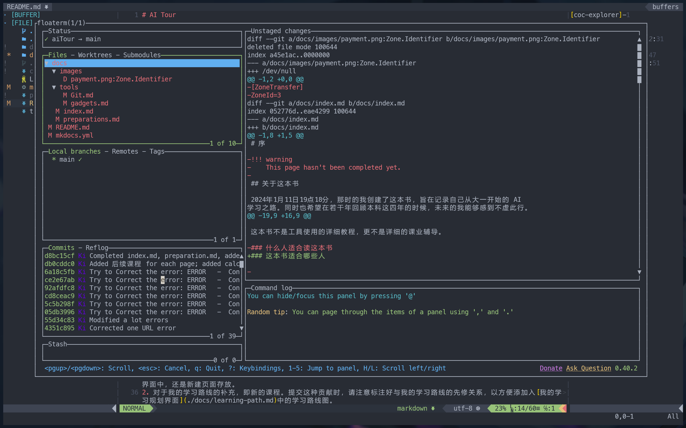

- Markdown preview

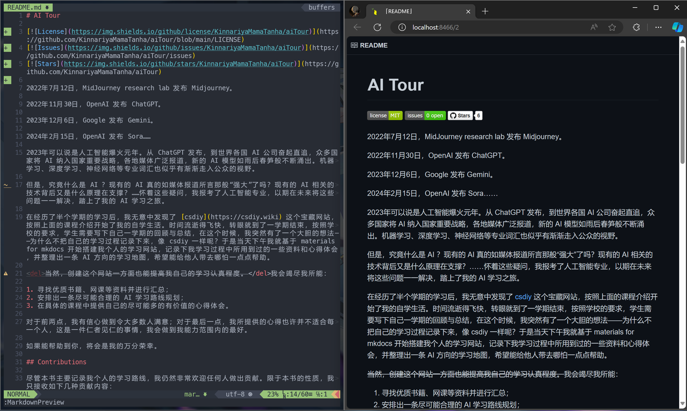

- Zen mode

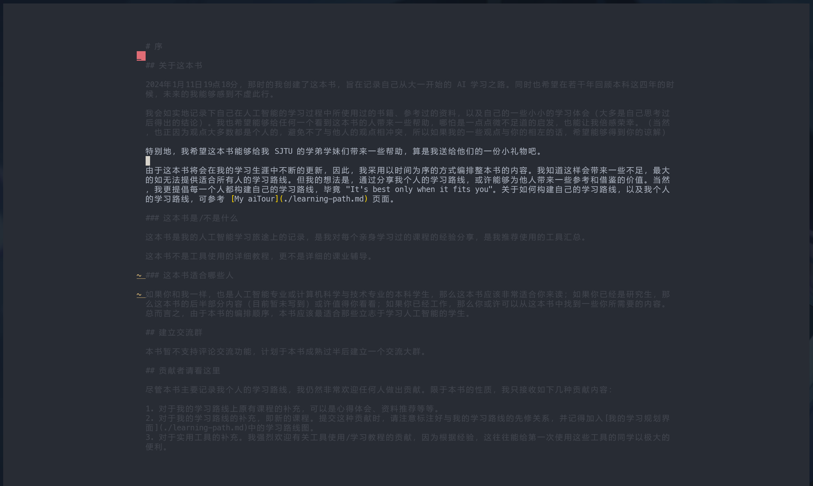
